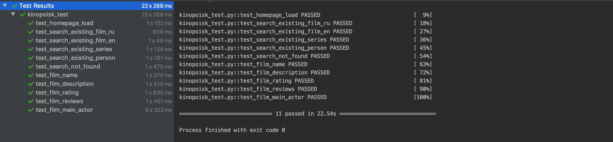

# # План тестирования для основной страницы Кинопоиска

## 1. Введение

Это план тестирования КиноПоиска. В каждом test case кроме нулевого, мы открыли браузер и зашли на страницу https://www.kinopoisk.ru/

## 2. Тестировочная стратегия  

### 2.0 Проверка, что это нужный сайт

# План тестирования для основной страницы Кинопоиска

## 1. Введение

Это план тестирования основной страницы КиноПоиска. В каждом test case кроме нулевого, мы открыли браузер и зашли на страницу https://www.kinopoisk.ru/

## 2. Тестировочная стратегия  

### 2.0 Проверка, что это нужный сайт

**Test case #0:** В названии сайта есть КиноПоиск

**Test steps:**

| Steps  | Expected results  |
| ------------- | ------------- |
| 1. Посмотрим на название страницы| В названии страницы есть “КиноПоиск” |

### 2.1 Тестирование строки поиска

**Test case #1:** Можно найти существующий фильм по названию на Русском языке

**Test steps:**

| Steps  | Expected results  |
| ------------- | ------------- |
| 1. Ввести в поле "Фильмы, сериалы, персоны" название "Матрица" | Успешно введено |
| 2. Нажать Enter | В поисковой выдаче рекомендован фильм "Матрица" |

**Test case #2:** Можно найти существующий фильм по названию на Английском языке

**Test steps:**

| Steps  | Expected results  |
| ------------- | ------------- |
| 1. Ввести в поле "Фильмы, сериалы, персоны" название "Matrix" | Успешно введено |
| 2. Нажать Enter | В поисковой выдаче рекомендован фильм "Матрица" |

**Test case #3:** Можно найти существующий сериал

**Test steps:**

| Steps  | Expected results  |
| ------------- | ------------- |
| 1. Ввести в поле "Фильмы, сериалы, персоны" название "Отбросы"/"Mistfits" | Успешно введено |
| 2. Нажать Enter | В поисковой выдаче рекомендован сериал "Отбросы" |

**Test case #4:** Можно найти существующую персону

**Test steps:**

| Steps  | Expected results  |
| ------------- | ------------- |
| 1. Ввести в поле "Фильмы, сериалы, персоны" имя актёра "Бенедикт Камбербэтч"/"Benedict Cumberbatch" | Успешно введено |
| 2. Нажать Enter | В поисковой выдаче предложена страница актера |

**Test case #5:** Нельзя найти что-то несуществующее

**Test steps:**

| Steps  | Expected results  |
| ------------- | ------------- |
| 1. Ввести в поле "Фильмы, сериалы, персоны" несуществующее название "Абвагад ывфр" | Успешно введено |
| 2. Нажать Enter | В поисковой выдаче нет записей |

### 2.2 Тестирование страницы фильма

**Test case #6:** На странице фильма присутствует название фильма

**Test steps:**

| Steps  | Expected results  |
| ------------- | ------------- |
| 1. Открыть страницу фильма "Джентельмены" | Страница загрузилась |
|   | На странице присутствует название фильма |

**Test case #7:** На странице фильма присутствует описание фильма

**Test steps:**

| Steps  | Expected results  |
| ------------- | ------------- |
| 1. Открыть страницу фильма "Побег из Шоушенка" | Страница загрузилась |
|   | На странице присутствует описание фильма |

**Test case #8:** На странице фильма присутствует рейтинг фильма

**Test steps:**

| Steps  | Expected results  |
| ------------- | ------------- |
| 1. Открыть страницу фильма "Зеленая миля" | Страница загрузилась |
|   | На странице присутствует рейтинг фильма и он находится в пределах от 0 до 10|

**Test case #9:** На странице фильма присутствуют отзывы критиков

**Test steps:**

| Steps  | Expected results  |
| ------------- | ------------- |
| 1. Открыть страницу фильма "Форрест Гамп" | Страница загрузилась |
|   | На странице присутствует 10 случайных отзывов критиков |

**Test case #10:** На странице фильма можно найти главного актера

**Test steps:**

| Steps  | Expected results  |
| ------------- | ------------- |
| 1. Открыть страницу фильма "Остров проклятых" | Страница загрузилась |
|   | На странице присутствует имя актера (Леонардо ДиКаприо), исполняющего главную роль |
